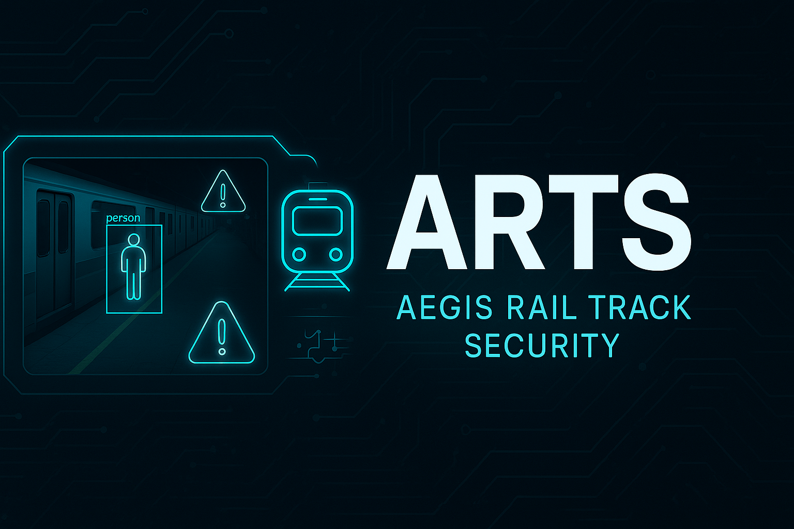
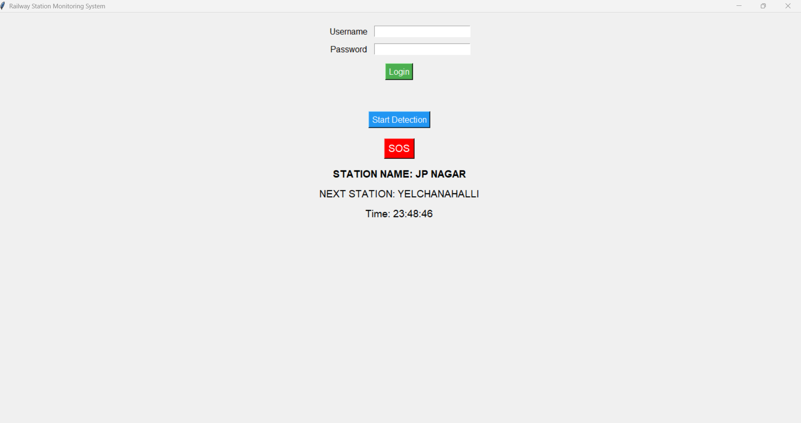
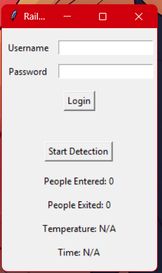

# 🚦 Railway Station Monitoring System

A real-time AI-based monitoring system for railway/metro platforms using YOLOv5 and OpenCV. This project detects passengers near the platform edge, provides alerts when safety lines are crossed, and announces train arrivals via text-to-speech.

---

## 🎯 Features

- 🚨 Detects people crossing the yellow line
- 📢 Announces train arrival with voice alert
- 📊 Displays temperature and current time
- 👤 Login system using a simple GUI
- 🎥 Processes live or recorded video with bounding boxes

---

## 🖥️ Demo

| Detection Frame | Alert Trigger |
|-----------------|---------------|
|  |  |

---

## 🧠 Tech Stack

- **Python 3**
- **YOLOv5s (via PyTorch Hub)**
- **OpenCV** – video processing
- **Tkinter** – GUI interface
- **pyttsx3** – text-to-speech
- **Requests** – (dummy API for temperature)

---

## 📁 Folder Structure

<pre> ``` railway-station-monitoring/ ├── src/ │ └── main.py # Main script for detection & GUI ├── resources/ │ └── yolo_info.md # Notes on YOLO usage ├── assets/ │ ├── demo1.png │ ├── demo2.png │ ├── demo3.png │ ├── demo4.png │ ├── demo5.png │ └── Demo_Video_ARTS.mp4 # Output video ├── requirements.txt # Dependencies ├── README.md # Project overview and usage └── .gitignore # Ignore list ``` </pre>

---

## ⚙️ Setup Instructions

1. **Clone the repo**
   ```bash
   git clone https://github.com/your-username/railway-station-monitoring.git
   cd railway-station-monitoring.

2. ** Install dependencies**
   ```bash
   pip install -r requirements.txt

3. ** Run the Project**
   ```bash
   python src/main.py
